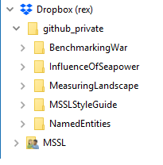

<!-- README.md is generated from README.Rmd. Please edit that file -->
MSSLStyleGuide
==============

Research projects at the cPASS Machine-Learning for Social Science Lab (MSSL) are complex in terms of authors, methods, and data. MSSL has adopted a project management system based on Github, RStudio, and Latex that is efficient, organized, transparent, and replicable. This Github repository titled MSSLStyleGuide documents this system as it develops and guides new users in setting up a work station, joining a project, and developing and documenting content.

Setup
-----

### Work Station Setup

To collaborate on a MSSL project you need the following:

#### Dropbox

MSSL has a [Dropbox](https://www.dropbox.com) business account named "rex". If you have not yet been invited, create a [MSSLStyleGuide issue](https://github.com/rexdouglass/MSSLStyleGuide/issues) with the label "MSSL". If you already have a personal Dropbox account, you can connect it to "rex"; the two accounts will remain seperate but you will be able to access both of them on all your devices.

In the Dropbox folder, create a folder titled "github\_private". This folder is where you will keep projects to make edits and then push to the cloud.

You will also be given access to a shared folder called "MSSL". This folder is mainly for data files that are proprietary or too big for github.

When ready Dropbox should look like below with "github\_private" and "MSSL" located in "Dropbox (rex)".

Note that "github\_private"" will initially be empty until you join specific projects.

#### R and RStudio

[R](https://www.r-project.org/) is a language and environment for statistical computing and graphcis. It is freely available, very flexible, and make pretty plots. [Download R from the UCLA mirror](http://cran.stat.ucla.edu/) for your operating system and install it.

[RStudio](https://www.rstudio.com/) is a workspace that sits on top of R and makes it easier to edit code, plot data, and share your work. When working in R you will actually open RStudio application instead of the R application. [Download the installer of the free open source version](https://www.rstudio.com/products/rstudio/download/) for your operating system and install it.

#### Github

[Github](https://github.com/) is a development platform for managing coding projects. If you do not already have a github profile, [sign up for a free account](https://github.com/). When you are logged in, go to [Rex Douglass's account](https://github.com/rexdouglass) and select "Follow" under profile picture. Rex will add you to the repository for a project; you can remind him to by selecting the appropriate repository, selecting the "Issues" tab (between "Code" and "Pull requests") and creating a "New Issue".

#### Latex

To be added.

### Project Setup

Datawork
--------

### General Coding

Underscores "\_" not periods "."

### Data Storage

### Functions in R

#### Writing Functions

-   R functions go in their own individual .r file.
-   The name of the file should be the same as the name of the function
-   [Functions should have documentation using roxygen headers](https://rexdouglass.github.io/MSSLStyleGuide/Function_Documentation.nb.html)

#### Calling Functions

-   [Calling functions from other packages](http://kbroman.org/pkg_primer/pages/depends.html)
-   As a lab, we'll be using the :: operator every single time we call a function from an external package, e.g. glue::glue, plyr::dplyr

### Packages

-   All calls to external packages should made on the Imports and Suggests lines in the DESCRIPTION file. Any calls to library() in the analysis should be commented out.
-   [Packrat](https://rstudio.github.io/packrat/)

### Analysis in R-Notebook

All analysis should be in an R-Notebook.

select File -&gt; New File -&gt; R Notebook

### R-Markdown

Each R-Markdown should be self-contained with unique outputs

Writing
-------
