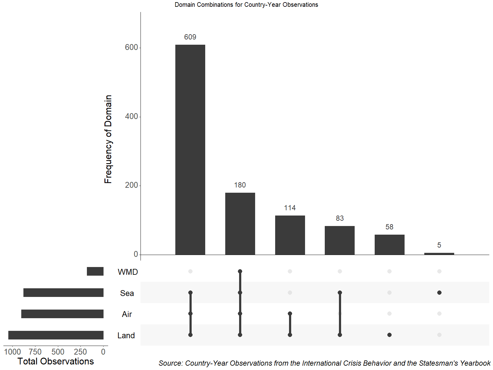

  
  <style>
  body .main-container {
    max-width: 100%;
  }
</style>
  

```{r setup, include=FALSE}
knitr::opts_chunk$set(echo = TRUE)
```

# UpSet Plots in R: An Alternative to Venn Diagrams

Essentially, UpSet plots are a concise and easy-to-understand version of a Venn Diagram. Rather than looking at several proportional overlapping circles, one can view the frequencies of the interactions of given variables in bar-plot form. They are very easy to plot in R, are incredibly useful for conveying multiple variables and their relationship with one another, and there exists several useful resources online (see the final section of this R Markdown file.

# UpSet with ICB Data
Set up workspace
```{r}

# Load packages
library(magrittr)
library(ggplot2)

# Install data
icb_denom <- readRDS(paste0(here::here(), '/data/icb_denom.rds'))

```
We want to look at which country-year observations in the ICB dataset have which combination of domains (land, sea, air, and weapons of mass destruction). Note that, for the purposes of visualization, NA values need to be set to 0. 
```{r}

# Subset for domain and clean data
icb_denom_dom <- icb_denom %>%
  dplyr::select(year, year_pdf,
               actor,
               #crisis_year_dum,
               domain_air,
               domain_land,
               domain_sea,
               domain_wmd,
               #coder_uncertain,
               raw_text,
               coder_notes
               ) %>%
  dplyr::mutate(domain_wmd = ifelse(domain_wmd == 10, 1, domain_wmd),
                domain_air = ifelse(domain_air == 11, 1, domain_air)) %>%
  dplyr::rename("Air" = domain_air,
                "Land" = domain_land,
                "Sea" = domain_sea,
                "WMD" = domain_wmd)
icb_denom_dom[is.na(icb_denom_dom)] <- 0
icb_denom_dom <- as.data.frame(icb_denom_dom)

```
Now we generate the UpSet plot. Note that the grid:: commands are for additional annotations and are completely optional.  
```{r}
# upset
UpSetR::upset(icb_denom_dom,
      nsets = 4, number.angles = 0, point.size = 3.5, line.size = 2, text.scale = 2.2,
      mainbar.y.label = "Frequency of Domain", sets.x.label = "Total Observations", order.by = "freq")

grid::grid.text(
  "Source: Country-Year Observations from the International Crisis Behavior and the Statesman's Yearbook (1919-2014)",
  x = 0.70,
  y = 0.02,
  gp = grid::gpar(
    fontsize = 14,
    fontface = 3
  )
)

grid::grid.edit('arrange', name="icb_denom_dom")

vp <- grid::grid.grab()
gridExtra::grid.arrange(
  grobs = list(
    vp
  ),
  top="Domain Combinations for Country-Year Observations",
  fontsize = 16,
  cols=1
)

```
Here is our output. Clear, concise, and able to simplify our large-N ICB dataset. 


# Further Resources

[CRAN](https://cran.r-project.org/web/packages/UpSetR/vignettes/basic.usage.html)

[Little Miss Data's Blog](https://www.littlemissdata.com/blog/set-analysis)

[Little Miss Data's GitHub](https://github.com/lgellis/MiscTutorial/tree/master/sets)

[R-bloggers](https://www.r-bloggers.com/hacking-our-way-through-upsetr/) 